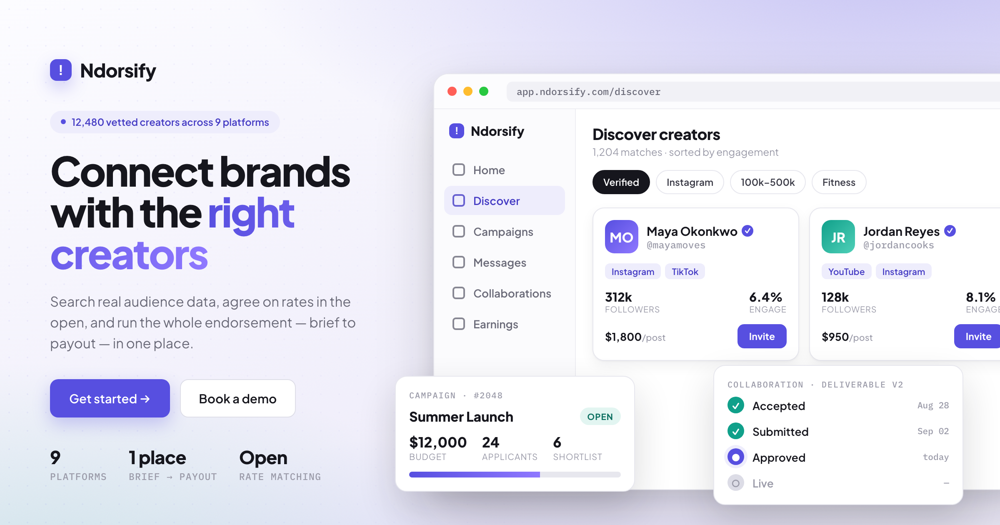

<div align="center">



<br />

# Ndorsify — Web App

**The web client for Ndorsify — the endorsement marketplace where brands and creators run campaigns together, brief to payout, in one place.**

Search real audience data · agree on rates in the open · track every collaboration to delivery.

<br />


</div>

---

## About

This is the **React web client** for Ndorsify. It talks to a mesh of FastAPI
services that live in a separate repository:
**[ndorsify-backend-microservices](https://github.com/ndorsify/ndorsify-backend-microservices)**.

Ndorsify connects **brands** with **creators / influencers** for endorsements
and campaigns, replacing scattered DMs, spreadsheets, and invoices with a single
workflow:

> **Discover → Invite → Agree → Collaborate → Deliver → Pay**

## What's in the app

|     | Screen                 | What it does                                                                                                                                                |
| --- | ---------------------- | ----------------------------------------------------------------------------------------------------------------------------------------------------------- |
| 🔎  | **Discover**           | Search a vetted creator catalog by platform, follower band, engagement, niche, verified status, and rate — with a live filter panel, chips, and shortlists. |
| 📣  | **Campaigns**          | Build a brief (objective, budget, dates) and publish to the marketplace; creators apply.                                                                    |
| 🤝  | **Collaborations**     | A board driving each deliverable through `accepted → submitted → approved → live`, with version history and a timeline.                                     |
| 💬  | **Messages**           | Real 1:1 inbox between brands and creators.                                                                                                                 |
| 👤  | **Profiles**           | Public creator profiles with audience stats, rate cards, and verified badges.                                                                               |
| 💰  | **Earnings & Reports** | Campaign performance and creator payout dashboards.                                                                                                         |

## Tech stack

- **React 19** on **Vite**
- **Redux Toolkit + RTK Query** for state and data fetching (with silent
  token-refresh on 401)
- A shared **`nd-*` design system** — see [`src/styles/ndorsify.css`](src/styles/ndorsify.css)
  and [`src/components/common/ds.js`](src/components/common/ds.js)
- **Plus Jakarta Sans** / **IBM Plex Mono**, indigo (`#574fe0`) accent

## Getting started

**Prerequisites:** Node.js 24 LTS (see `.nvmrc`) and npm.

```bash
npm install
npm start
```

The dev server runs on **http://localhost:3000**.

### Run the full stack (frontend + all backend services)

From the **workspace root** (one level up), a single script boots all seven
FastAPI services on SQLite — no Postgres or Docker needed — plus this web
client:

```bash
cd ..
./start.sh          # web client on http://localhost:5055
```

See the [backend repo](https://github.com/ndorsify/ndorsify-backend-microservices)
for running the services on their own.

## Common commands

| Command          | What it does                                      |
| ---------------- | ------------------------------------------------- |
| `npm start`      | Run the dev server                                |
| `npm run build`  | Production build to `dist/`                       |
| `npm test`       | Vitest, once (`npm run test:watch` to watch)      |
| `npm run format` | Auto-format with Prettier                         |
| `npm run check`  | Check formatting                                  |

## Project structure

```
src/
├── app/          # store, root layout, routing
├── features/     # screen-level features (auth, discovery, campaigns,
│                 #   collaborations, messaging, profile, earnings, reports, …)
├── components/   # shared UI: common/ primitives + SignIn / SignUp
├── styles/       # nd-* design system (ndorsify.css)
├── lib/          # helpers, API base query
├── routes/       # route & API path constants
└── assets/       # images & logos
```

## Documentation

- [`AGENTS.md`](AGENTS.md) — architecture map for new devs and AI agents,
  including known issues worth fixing before building new screens.
- [`CLAUDE.md`](CLAUDE.md) — command reference and design-system conventions.
- [`docs/`](docs/) — knowledge base: [ADRs](docs/adr/), [plans](docs/plans/),
  [playbooks](docs/playbooks/).

## Status

Early-stage and under active development. The core loop — discover, campaign,
apply, collaborate, message — runs end-to-end against the live stack today.
OAuth sign-in is stubbed.

<div align="center">
<br />
<sub>The screenshot above is a design mockup rendered from Ndorsify's own <code>nd-*</code> design system.</sub>
</div>
